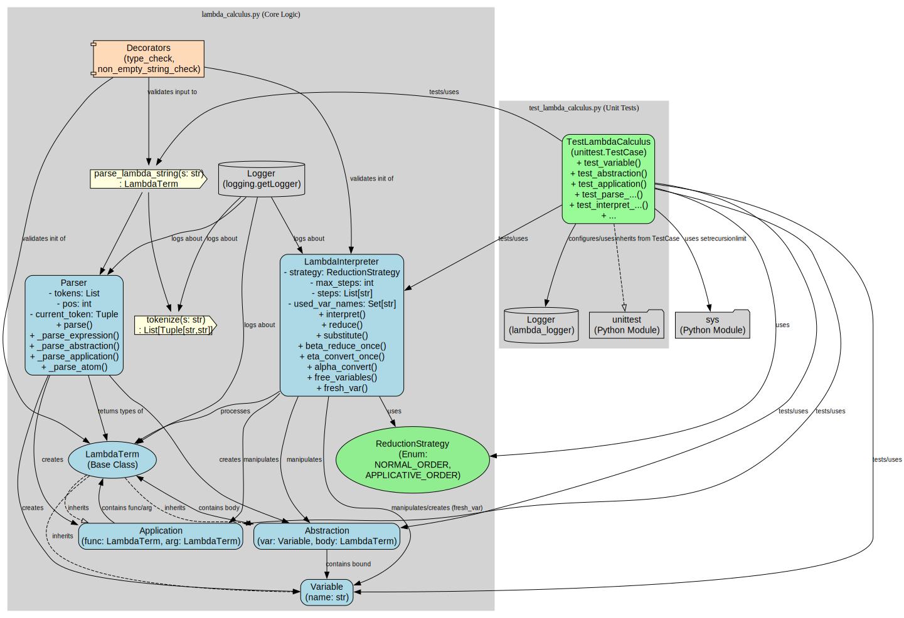

# Genshin_impact - lab 3 - variant 6

This is an example project which demonstrates project structure and necessary
CI checks. It is not the best structure for real-world projects, but good
enough for educational purposes.

## Project structure

- `lambda_calculus.py` -- implementation of Lambda‐calculus.
- `test_lambda_calculus.py` -- tests for `lambda calculus`.

## Features

- Test functions.

## Contribution

- GAO Lichen -- all work, 'cause there's only one member.

## Changelog

- 29.03.2022 - 2
   - Add test coverage.
- 29.03.2022 - 1
   - Update README. Add formal sections.
- 29.03.2022 - 0
   - Initial

## Design notes

- 
